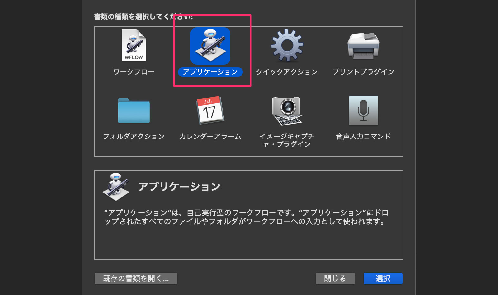
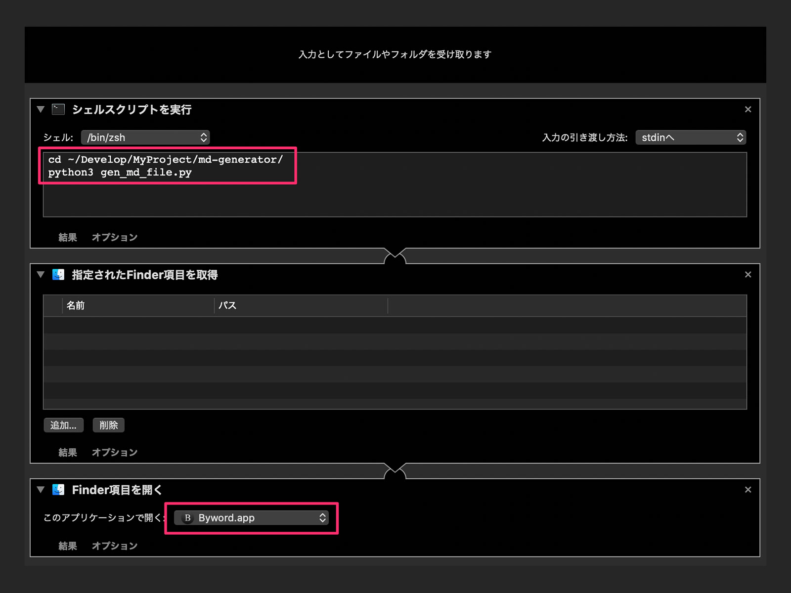
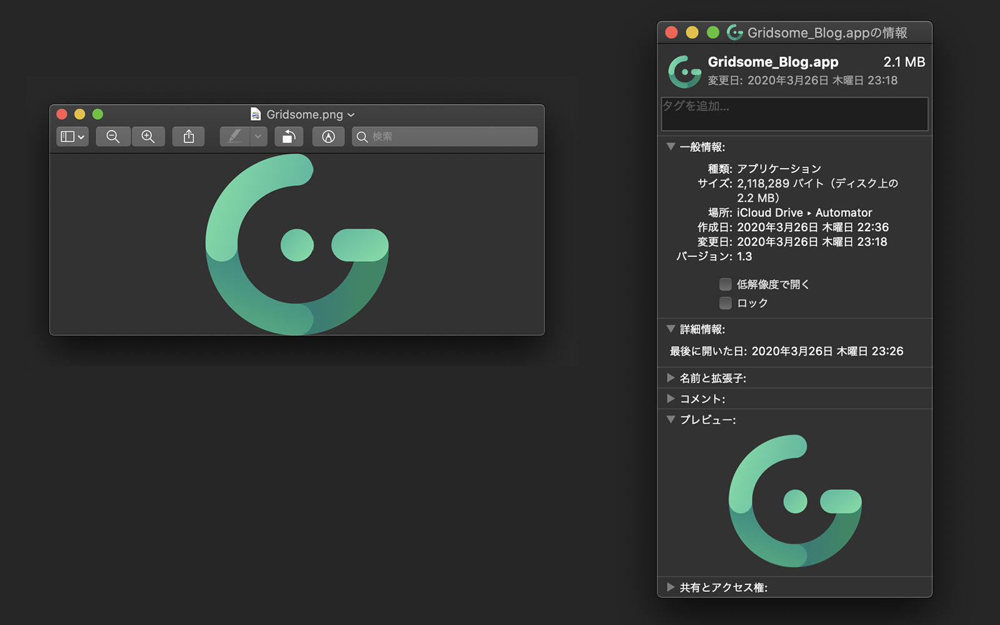
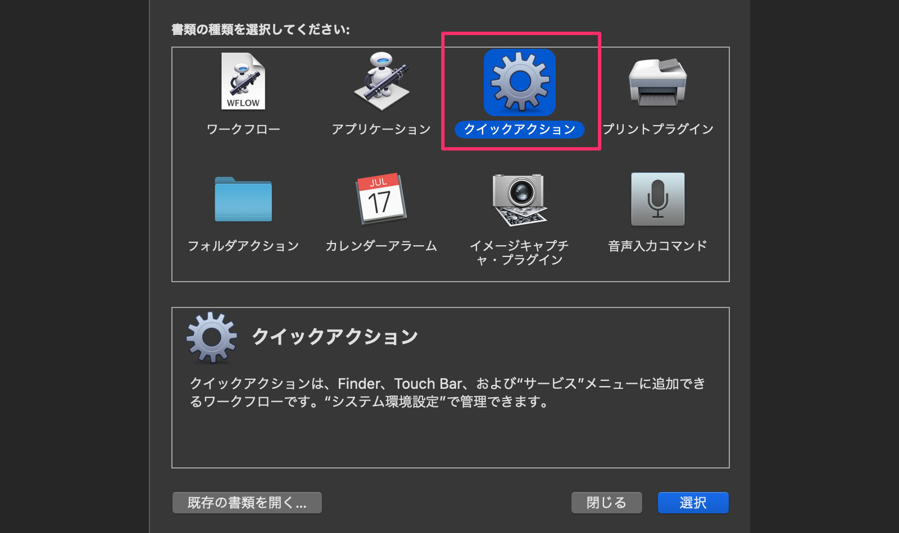
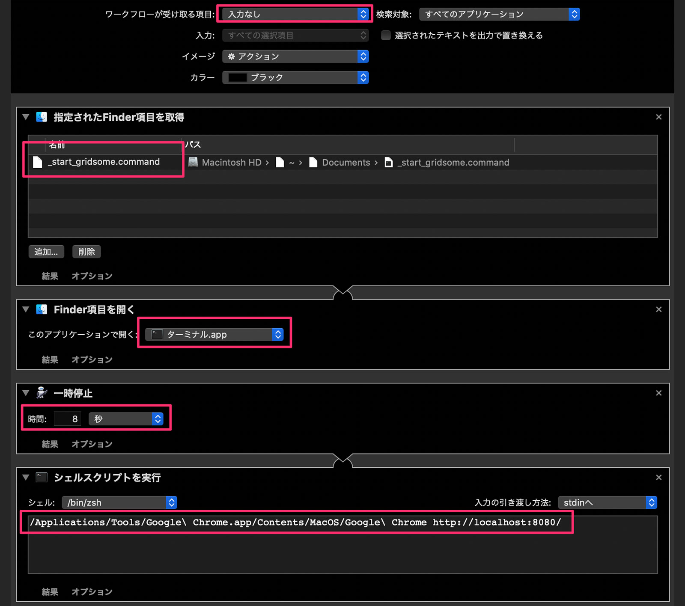
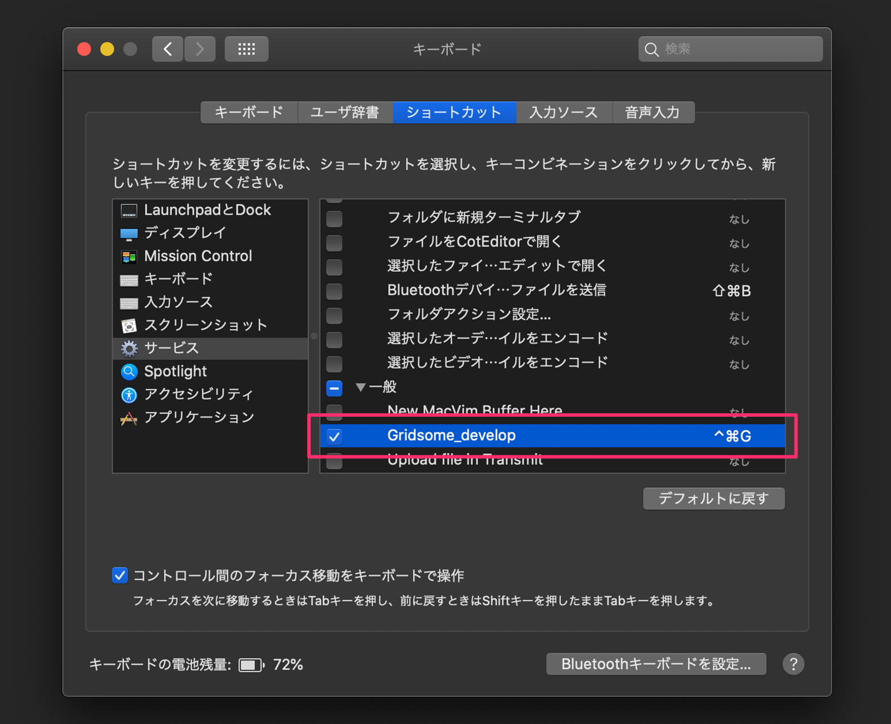

静的サイトジェネレーター（SSG）で作ったサイトの記事は、Markdown ファイルで管理します。

WordPress でいう Title、Date、Description、Category、tags などの設定もできて、ファイルの冒頭に Front matter と呼ばれるデータを書きこむことで、SSG がよしなに判断してあれこれしてくれます。

ただ、記事を書くたびに

* ファイルを作成
* Front matter（定型文）をコピペ
* タイトルや日付などを入力

をするのは手間がかかるので macOS の Automator を使ってツールを2つ作りました。

* **ダブルクリックで Markdown ファイルを作り、任意のエディタを起動する**
* **ショートカットキーで gridsome develop を起動し、指定ブラウザで localhost に接続する**

この記事では Python をどのように組んだか、macOS の Automator をどのように使ったかをまとめます。

## ダブルクリックで Markdown ファイルを作り、任意のエディタを起動する

※記事の最後にソースコードを載せています。

### 1. Python で Markdown ファイルを作る

僕のサイトでは記事ディレクトリを static 配下に置いています。

```
/static/posts/blog/
                 |
                 |_001/
                 |   |_img/
                 |   |_001_200322.md
                 |
                 |_002
                 |   |_img/
                 |   |_002_YYMMDD.md
                 |
                 （以降、003、004と記事ごとに増えていく）
```

「ディレクトリ名が1つずつ加算されている」部分やファイル名の「YYMMDD」などがプログラミングの使い所です。

ディレクトリやファイル操作には Pathlib を使います。

参考：[pathlib --- オブジェクト指向のファイルシステムパス](https://docs.python.org/ja/3/library/pathlib.html)

<br>

次は Front matter です。

これは以下のようなデータ群になってます。「$」ではじまっている変数はスクリプトの実行都度に補足します。これを毎回コピべするのはすっごく避けたいからここでもプログラミングの力を使います。

```js
 // template.txt

---
title:
date: $date
createdAt: $date
updatedAt: $date
description:
image: $image
slug: $slug
category:
tags:
type: $type
---
```

定型文かつ、動的にデータを補足したい場合は String モジュールのテンプレートがおすすめ。

参考：[string --- 一般的な文字列操作](https://docs.python.org/ja/3/library/string.html)

<br>

使い方はかんたんで、Front matter の定義ファイルを開いて、substitute() で$変数に値を入れる。それを Markdown ファイルに write() で OK！

```py
# gen_md_file.py（抜粋）

import string

md_full_path = f"{dir_path}/{dir_name}_{s_date}.md"

with open("template/front_matter.txt") as fm:
    t = string.Template(fm.read())
    template = t.substitute(date=l_date, image=img_path, slug=slug, type=post_type)

    with open(md_full_path, "w") as new_md:
        new_md.write(template)
```

### 2. Automator からスクリプトを実行してエディタを起動する

スクリプトは作れたけど、新規記事を書くたびに python コマンドを叩くのは手間です。それに、どうせなら Markdown ファイルを開いてすぐブログを書きはじめられたら素敵じゃないですか。

そんなときは Automator にシェルコマンドを入力してもらいましょう。

<br>

Automator の「アプリケーション」を選択。



Automator で Python を実行するにはシェルから実行してもらうようにしないといけません。

* シェルスクリプトを実行
* 指定された Finder 項目を取得
* Finder 項目を開く

をつなげていきます。



シェル実行時に Markdown ファイルの絶対パスを print() で出力しています。それが「指定された Finder 項目を取得」につながって、次の「 Finder 項目を開く」へとつながっていきます。

なんとなくイメージがつかめるんじゃないでしょうか。

<br>

さらにどうせならと Automator で作ったアプリのアイコンも変えます。



まず作成したアプリの情報ウィンドウを表示させます（command + i）。左上のアイコンを選択状態にしておいて、あらかじめコピーしておいた画像を command+v してあげれば OKです。

## ショートカットキーで gridsome develop を起動し、指定ブラウザで localhost に接続する

記事を書きながらプレビューできたら便利ですよね。今回はショートカットキーで起動するようにします。

<br>

「クイックアクション」を選択。



以下の順でつなげていきます。

* 指定された Finder 項目を取得（後述のコマンドファイルを指定）
* Finder 項目を開く
* 一時停止（ビルドにちょっと時間がかかるため）
* シェルスクリプトを実行（Safari 以外のブラウザを使うため）



### コマンドファイル

「シェルスクリプトを実行」から gridsome develop をすると、ctrl + c で gridsome のプロセスを停止できません。僕から見えない誰かがプロセスを握ってしまっているためだと思います。

なので、以下のコマンドファイルを作ってあげる必要があります。

```
touch _start_gridsome.command
vim _start_gridsome.command

cd ~/Develop/MyProject/gridsome_nnamm/
gridsome develop
```

実行権限をつけるのを忘れずに。

```
chmod a+x _start_gridsome.command
```

### ショートカットキーの設定

クイックアクションはサービス扱いになるため、システム環境設定から任意のショートカットキーを割り当ててあげましょう。



以上で完成です。

## おわりに

これで、アプリアイコンをダブルクリックするだけでブログが書けるようになりましたし、必要に応じてショートカットキーでプレビュー画面を起動する、という環境が整いました。

大満足！

## 補足：gen_md_file.py（全体）

```py
"""
新規ブログ記事の雛形Markdownファイルを作るスクリプト
所定のディレクトリに、以下のディレクトリを作成する
...blog/
      |__001
           |_img/
           |_001_YYMMDD.md（フロントマター含）
"""

import configparser
import datetime
import pathlib
import string


def create_front_matter_info(work_dir: str) -> dict:
    """ フロントマター用のデータを作成する
    Args:
        work_dir: 所定のディレクトリパス
    Returns:
        dict: フロントマターに設定する情報
    """

    fm_dict = {
        "new_dir_name": "",  # 新記事を格納するディレクトリ名（作業用）
        "new_dir_path": "",  # 上記を含めたフルパス
        "created_date_long": "",  # 記事作成日時ロング版（スクリプト実行日時）
        "created_date_short": "",  # 上記のショート版
        "eye_path": "",  # アイキャッチの画像のパス
        "slug_str": "",  # スラッグ
        "post_type": "blog",  # ポストタイプはblog
    }

    # 新記事のディレクトリ名（ゼロパディング）とフルバス
    p = pathlib.Path(work_dir)
    dir_list = [p.name for p in p.iterdir() if p.is_dir()]
    dir_list.sort()
    latest_dir = int(dir_list[-1])
    fm_dict["new_dir_name"] = str(latest_dir + 1).zfill(3)
    fm_dict["new_dir_path"] = work_dir + fm_dict["new_dir_name"]

    # 新記事の作成日時（long: YYYY-MM-DD HH:MM:SS / short: YYYYMMDD）
    dt = datetime.datetime.now().strftime("%Y-%m-%d %H:%M:%S")
    fm_dict["created_date_long"] = dt
    fm_dict["created_date_short"] = (dt[2:10]).replace("-", "")

    # アイキャッチの画像パス
    fm_dict["eye_path"] = f'/ec/blog/ec_blog_{fm_dict["new_dir_name"]}.jpg'

    # スラッグ
    fm_dict["slug_str"] = f'{fm_dict["new_dir_name"]}-{fm_dict["created_date_short"]}-'

    return fm_dict


def generate_blog_file(params: dict):
    """ 新記事のディレクトリとファイルを作成する
    Args:
        params: フロントマターに設定する情報
    """

    dir_name = params["new_dir_name"]
    dir_path = params["new_dir_path"]
    l_date = params["created_date_long"]
    s_date = params["created_date_short"]
    img_path = params["eye_path"]
    slug = params["slug_str"]
    post_type = params["post_type"]

    # ディレクトリを作成
    pathlib.Path(dir_path + "/img/").mkdir(parents=True)

    # mdファイルにテンプレートからフロントマターを設定
    md_full_path = f"{dir_path}/{dir_name}_{s_date}.md"
    with open("template/front_matter.txt") as fm:
        t = string.Template(fm.read())
        template = t.substitute(date=l_date, image=img_path, slug=slug, type=post_type)
        with open(md_full_path, "w") as new_md:
            new_md.write(template)

    # macOSのAutomatorと連携するために引数としてファイルパスを出力
    print(md_full_path)


if __name__ == "__main__":
    config = configparser.ConfigParser()
    config.read("config.ini")
    blog_path = config["path"]["blog"]

    generate_blog_file(create_front_matter_info(blog_path))
```

参考：[GitHub](https://github.com/nnamm/md-generator)

※勉強がてら flake8/pylint/black を導入し、PyCharm で使ってみました。pytest もやってようと思います。
