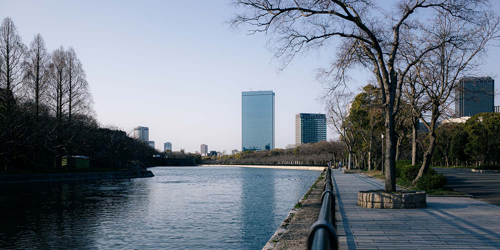

Gridsomeには「multiple templates for a collection」という仕組みがあって、1つのコレクションを複数のテンプレートに対応させることができます。

参考：[Templates - Gridsome](https://gridsome.org/docs/templates/)

基本的にコレクション（mdファイル等）とテンプレート（vueファイル）は1対1の関係ですが、任意のページだけ専用のテンプレートを適用できるもの、と僕は理解してます。

しかし、Buildすると同じ記事データが複数生成されてしまい、記事の重複が起こりました。

distをそのままサーバーにアップロードしたらSEO的にどうなの？と考えた末、ひとまず、テンプレート内で「v-if / v-if-else / v-else」を使って乗り切ることにしました。


## 記事が重複する？

サイト公開当初は1種類のコレクション（Markdown）からGraphQLのFilterを使って、3種類のコンテンツを抽出していました。

```
// コンテンツ抽出イメージ

コレクション（*.md）
|
|___ Blogコンテンツ（Post.vue）
|___ Graphicコンテンツ（Graphic.vue）
|___ Photoコンテンツ（Photo.vue）
```

```js
// gridsome.config.js（サイト公開当初の設定、一部抜粋）

plugins: [
  {
    use: '@gridsome/source-filesystem',
    options: {
      path: 'static/posts/**/**/*.md',
      typeName: 'Post',
      remark: {
        plugins: ['@gridsome/remark-prismjs']
      }
    }
  }
]

（中略）

templates: {
  Post: [
    {
      // ブログ用
      path: '/posts/:slug',
      component: './src/templates/Post.vue'
    },
    {
      // グラフィック作品用
      path: '/graphics/:slug',
      component: './src/templates/Graphic.vue'
    },
    {
      // 写真作品用
      path: '/photos/:slug',
      component: './src/templates/Photo.vue'
    },
  ]
}
```

↑をすることで上手いこと生成してくれるかと思いきや・・・以下のようにファイルが生成されてしまいました。

```
// この重複っぷりったら（笑）

dist
|
|__ posts
|   |__ Blogコンテンツ1
|   |   |__ index.html
|   |__ Blogコンテンツ2
|   |   |__ index.html
|   |__ Graphicコンテンツ1（本来不要）
|   |   |__ index.html
|   |__ Photoコンテンツ1（本来不要）
|   |   |__ index.html
|   |__ Photoコンテンツ2（本来不要）
|       |__ index.html
|
|__ graphic
|   |__ Blogコンテンツ1（本来不要）
|   |   |__ index.html
|   |__ Blogコンテンツ2（本来不要）
|   |   |__ index.html
|   |__ Graphicコンテンツ1
|   |   |__ index.html
|   |__ Photoコンテンツ1（本来不要）
|   |   |__ index.html
|   |__ Photoコンテンツ2（本来不要）
|       |__ index.html
|
|__ photo
    |__ Blogコンテンツ1（本来不要）
    |   |__ index.html
    |__ Blogコンテンツ2（本来不要）
    |   |__ index.html
    |__ Graphicコンテンツ1（本来不要）
    |   |__ index.html
    |__ Photoコンテンツ1
    |   |__ index.html
    |__ Photoコンテンツ2
        |__ index.html
```

URLとしてはすべてのルートが生成されているので、このままサーバーにアップロードしたら同じ記事だらけで「どれが本物か！？」とGoogleさんは思うでしょう。実際、Search Consoleには「重複してるよ」って言われました。

というわけで対策を考えます。

## 対策(1) robots.txt → 失敗

まず思いついたのはrobots.txtです。

Gridsomeのgridsome-plugin-robotsプラグインを使って、特定のURLのみdisallowとすることでした。

```js
// gridsome.config.js（サイト公開当初の設定、一部抜粋）

plugins: [

（中略）

  {
    use: 'gridsome-plugin-robots',
    options: {
      host: 'https://portfolio.nnamm.com',
      sitemap: 'https://portfolio.nnamm.com/sitemap.xml',
      policy: [
        {
          userAgent: '*',
          allow: '/',
          disallow: [
            '/posts/p0*',
            '/posts/g0*',
            '/photos/b0*',
            '/photos/g0*',
            '/graphics/b0*',
            '/graphics/p0*'
          ]
        }
      ]
    }
  }
```

しかし、これはdisallowが約束されたものではありません。想定していないURLがインデックスされる可能性がありますし、実際されちゃいました。

## 対策(2) v-ifを使って分ける → 成功

もともとBlog/Graphic/Photoそれぞれにテンプレート（vueファイル）を作り、デザインを分けていましたが、**1つのvueファイルに統合して、処理を切り分ければ良いんじゃなーい？**と気づきます。

「これだ！」というわけで、ベストプラクティスかはわかりませんが以下のようにしました。

1. URLのスラッグの先頭に投稿タイプの文字列を追加（Blogならb、Graphicならg、Photoならp → 例. b0001-200322-start-portfolio-site）
2. computedでGraphQLからスラッグの頭文字を取得
3. v-if="postType === 'b'"のようにして処理を分ける

```js
// Post.vue（一部抜粋）

<template>
  <Layout>

    <template v-slot:main-contents>
      <div v-if="postType === 'b'">
        〜 Blog用のデザイン 〜
      </div>

      <div v-else-if="postType === 'g'">
        〜 Graphic用のデザイン 〜
      </div>

      <div v-else>
        〜 Photo用のデザイン 〜
      </div>
    </template>

  </Layout>
</template>

<script>
export default {
  computed: {
    postType: function () {
      return this.$page.article.slug.substr(0, 1)
    }
  }
}
</script>

※$pageでGraphQLした結果にアクセスできるのでslugから文字を取得

<page-query>
query Post ($path: String!) {
  article: post (path: $path) {
    id
    title
    createdAt (format: "YYYY.MM.DD")
    updatedAt (format: "YYYY.MM.DD")
    description
    content
    image
    slug
    category
    tags
  }
}
</page-query>
```

結果、Buildすると想定したものだけが生成されていました。スッキリ！

```
dist
|
|__ posts
    |__ Blogコンテンツ1
    |   |__ index.html
    |
    |__ Blogコンテンツ2
    |   |__ index.html
    |
    |__ Graphicコンテンツ1
    |   |__ index.html
    |
    |__ Photoコンテンツ1
    |   |__ index.html
    |
    |__ Photoコンテンツ2
        |__ index.html
```

## おわりに

Vue.jsの条件付きンダリングを使って対応した、というお話でした。

Gridsomeはこのような仕様でしたが（僕の使い方が正しいか判断できませんが）、他のSSGはどうなんでしょうね。有名なNuxt.jsやGatsby.jsなんかも同じような感じなのかな。興味が湧いてきました。

とはいえ、まずは無駄なファイルが生成されずスッキリして良かったです。サーバーのディレクトリ構成やURLにこだわりがなければ、この対応で良いと思いますね。

あとはSearch Consoleのインデックスが更新されたらオッケー。しばらく様子見です。



※掲載した写真は春の大阪城公園をRICOH GRで撮影
