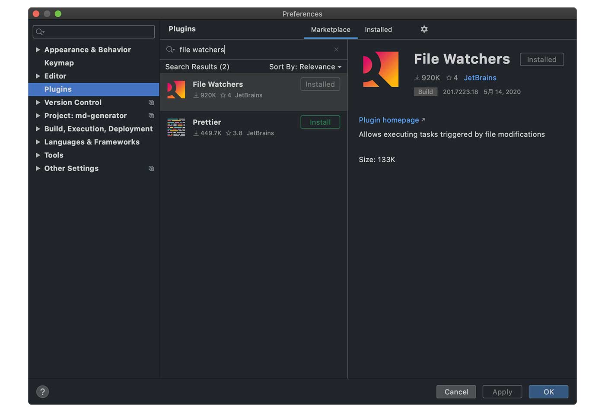
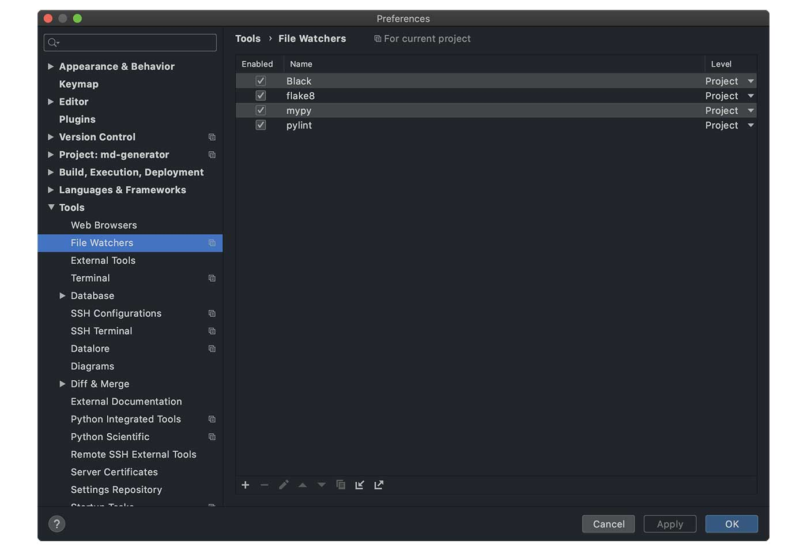
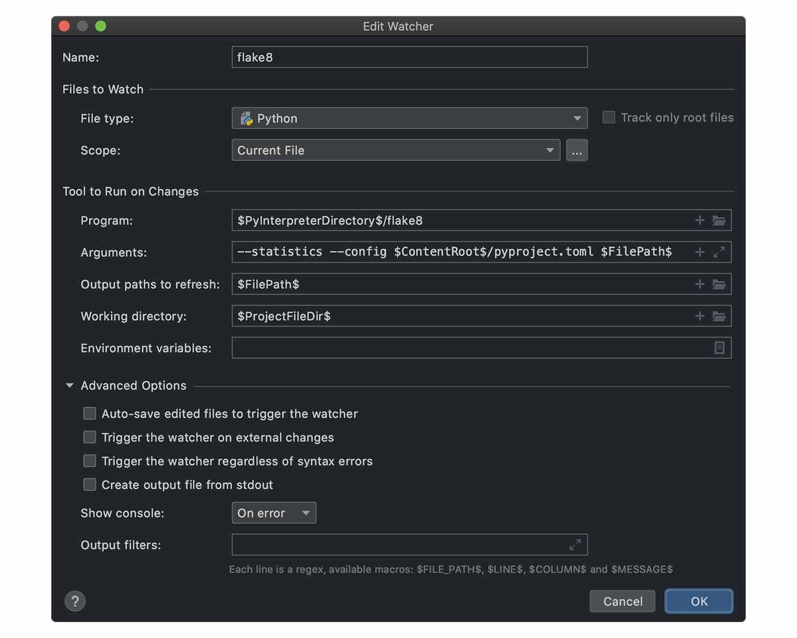
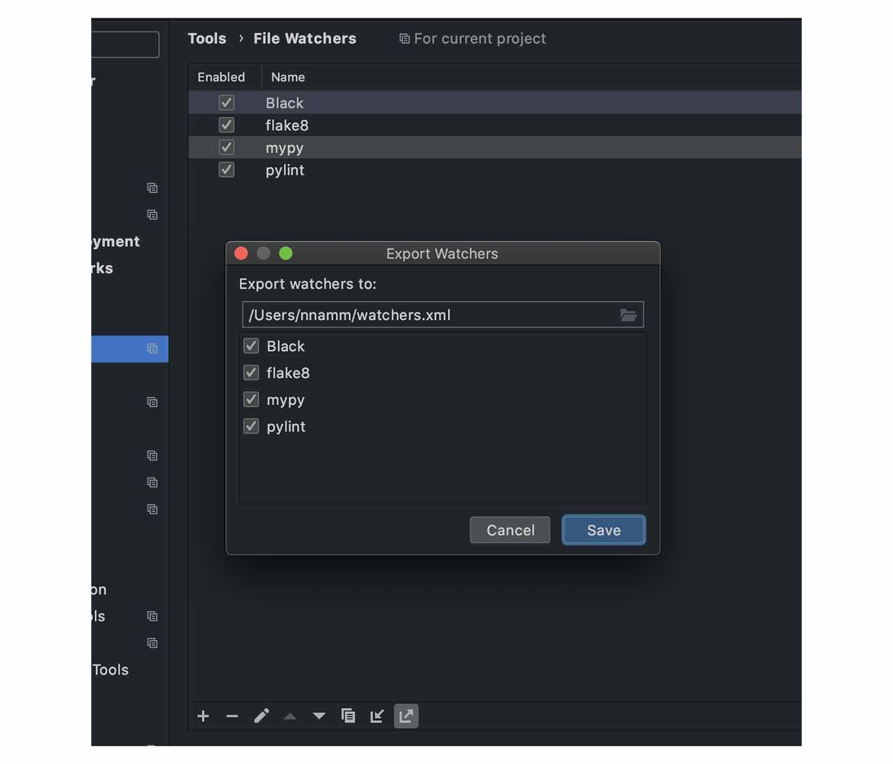

PyCharmできれいなコードを書くために以下のツールを設定しました。

* [Black](https://black.readthedocs.io/en/stable/)
* [flake8](https://flake8.pycqa.org/en/latest/index.html)
* [mypy](https://github.com/python/mypy)
* [Pylint](https://www.pylint.org/)

PyCharmは標準設定でもコードチェックや整形をやってくれますが、世界標準的（なのかな？）なツールを活用して「書き方の標準的なルール」に慣れようと思いました。

<br>

ことの発端はこちらの記事。実務はこうなのか〜と知って「じゃあ、僕もやってみよう」ってね。

▶︎ [Python開発を円滑に進めるためのツール設定 Part.1 - ログミーTech](https://logmi.jp/tech/articles/322611)

<br>

各ツールはコマンド入力することで機能しますが、僕はファイル監視機能もつけて、保存のたびに機能するようにしました。その設定方法をまとめます。

## File Watchersプラグイン

まずはファイルを監視してくれるプラグインを導入します。

Preferences → Plugins → `file watchers`と検索してGo!!



インストールすると、Preferences → Toolsに`File Watchers`の項目が追加されます。ここに各種ツールの設定を書いていきます。



## Black

[Black](https://black.readthedocs.io/en/stable/)はPython3.6以上で使える超強力なコードフォーマッターです。PEP8に準拠しているのはもちろん、「より制限のきついPEP8」と言われてる存在です。ユーザーからはほとんど設定変更ができないガッチガチ仕様。

▶︎ [The uncompromising code formatter](https://black.readthedocs.io/en/stable/)<br>

> 記事投稿時点でまだベータ版なので、今後仕様変更される可能性はあります。

### 設定

Blackは`pyproject.toml`を使用します。プロジェクト直下に生成し、文字数を120にしました。

```js
[tool.black]
line-length = 120
```

PyCharmのFile Watchersは以下のようにします。


| 項目 | 設定値 |
| ---- | ---- |
| Name | Black（任意名） |
| File type | Python |
| Scope | Current Fles or Project Filesなど |
| Program | $PyInterpreterDirectory$/black |
| Arguments | $FilePath$ |
| Output paths to refresh | $FilePath$ |
| Working directory | $ProjectFileDir$ |
| Auto-save edited files to trigger the watcher | off |
| Trigger the watcher on external changes | off |

「Tool to Run on Changes」は、CUIでコマンド入力する状態をGUIで設定する項目ですね。Blackは標準で`pyproject.toml`を読むので、引数はファイルパスだけです。そのほか、`black --help`やリファレンスを見ながら設定しました。

### $xxxxxxxxxx$について
PyCharmが用意してくれていて、プロジェクトディレクトリなどのショートカットです。「Tool to Run on Changes」の各欄の「+」をクリックすると選択できます。

## flake8

[flake8](https://flake8.pycqa.org/en/latest/index.html)は静的な文法チェックツールです。以下をラッパーしており、未使用変数のチェック（これはPyCharmの機能としてもある）など、コードとして「これおかしいよー」という部分を洗い出してくれます。

* PyFlakes
* pycodestyle
* Ned Batchelder’s McCabe script

### 設定

設定ファイルは一元管理したいので`pyproject.toml`に書きます。Blackと同じく文字数を120にしたり、循環的複雑度や無視したい警告やエラーを設定しました。

```js
[flake8]
max-line-length = 120
max-complexity = 20
ignore = [ 'E203', 'W503', 'W504' ]
```



| 項目 | 設定値 |
| ---- | ---- |
| Name | flake8（任意名） |
| File type | Python |
| Scope | Current Fles or Project Filesなど |
| Program | $PyInterpreterDirectory$/flake8 |
| Arguments | --statistics --config $ContentRoot$/pyproject.toml $FilePath$ |
| Output paths to refresh | $FilePath$ |
| Working directory | $ProjectFileDir$ |
| Auto-save edited files to trigger the watcher | off |
| Trigger the watcher on external changes | off |

`flake8 --help`やリファレンスを見ながら設定しました。

## mypy

[mypy](https://github.com/python/mypy)は静的な型ヒントチェッカーです。flake8と同じようなもので、適切に型ヒントかけているよね、という観点でみてくれます。

### 設定

こちらも`pyproject.toml`に書いちゃいます。これは使い始めたばかりなので設定できるものやメリットなどはこれから学んでいきます。

```js
[mypy]
ignore_missing_imports = 1
```


| 項目 | 設定値 |
| ---- | ---- |
| Name | mypy（任意名） |
| File type | Python |
| Scope | Current Fles or Project Filesなど |
| Program | $PyInterpreterDirectory$/mypy |
| Arguments | --config-file $ContentRoot$/pyproject.toml $FilePath$ |
| Output paths to refresh | $FilePath$ |
| Working directory | $ProjectFileDir$ |
| Auto-save edited files to trigger the watcher | off |
| Trigger the watcher on external changes | off |

`mypy --help`でいろいろ確認できます。

## Pylint

[Pylint](https://www.pylint.org/)も静的な文法チェックツールです。flake8と重複する部分もあるでしょうけど、両方採用して厳しめにチェックしてもいいだろうと思います。

### 設定

Pylintも`pyproject.toml`に設定することができるのですが、`.pylintrc`に書くことにしました。`pylint --generate-rcfile`するとたくさんの標準設定があり、それらを有効にした方が良いと考えたためです（まずはスタンダードで使うの心）。

ただ、標準設定だと多くの変数にたいして「大文字にせぃ」とのたまってきます。変数は小文字が普通だと思うのですが。。。

というわけで、`.pylintrc`にひとつ書き込みます。

```js
$ pylint --generate-rcfile > .pylintrc

$ vim .pylintrc
// [MESSAGES CONTROL]の”disable=”に以下を追記
invalid-name
```


| 項目 | 設定値 |
| ---- | ---- |
| Name | pylint（任意名） |
| File type | Python |
| Scope | Current Fles or Project Filesなど |
| Program | $PyInterpreterDirectory$/pylint |
| Arguments | --rcfile $ContentRoot$/.pylintrc $FilePath$ |
| Output paths to refresh | $FilePath$ |
| Working directory | $ProjectFileDir$ |
| Auto-save edited files to trigger the watcher | off |
| Trigger the watcher on external changes | off |

僕の環境ではPylint処理にほんちょっと時間がかかって気になっちゃう。なので、普段はPylintの自動処理を無効としておき、折を見て有効にしています。

有効・無効はFile Watchers設定画面からできます。

## 設定ファイルはエクスポートしておくと楽

Black/flake8/mypy/pylintの設定を毎回プロジェクトごとにやるのは手間。PyCharmには、ほかのプロジェクトでも流用できるよう、設定ファイルのインポート／エクスポート機能があります。

File Watchers設定画面の下部にある矢印アイコンがそれ。右上矢印がエクスポート、左下矢印がインポート。



`pyproject.toml`や`.pylintrc`も一緒に保存しておくのが吉。

## おわりに

Pythonの良い点に「コードの読みやすさ」があると言われています。でも、PEP8などのルールを無視して書いていたらその良さは活かせません。だから、この手のことはITの力に頼っちゃう。頼っていいのだ。

今回PyCharmで設定しましたけど、Visual Studio Codeでも同様の設定はできるので（主にsettings.jsonに書く）、自分の好きなエディタで開発を楽しんでいければいいなと思います。

## 参考にさせていただいた記事

* [Python開発を円滑に進めるためのツール設定 Part.1 - ログミーTech](https://logmi.jp/tech/articles/322611)
* [blackとpylintを使った快適なPython開発 - Qiita](https://qiita.com/navitime_tech/items/0a431a2d74c156d0bda2)
* [もうPythonの細かい書き方で議論しない。blackで自動フォーマットしよう - Make組ブログ](https://blog.hirokiky.org/entry/2019/06/03/202745)
