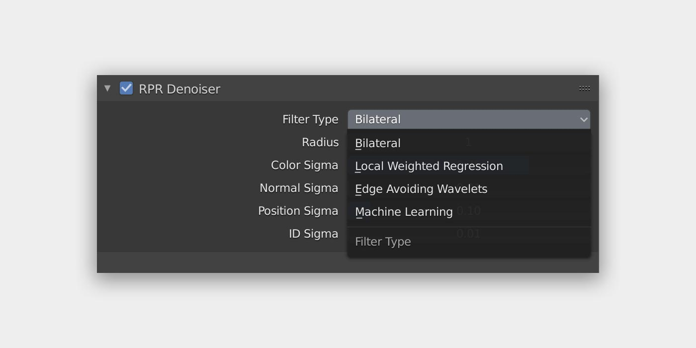
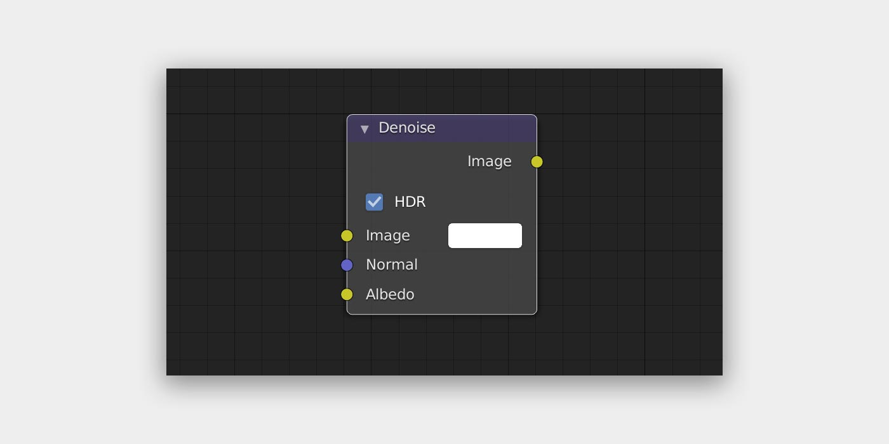
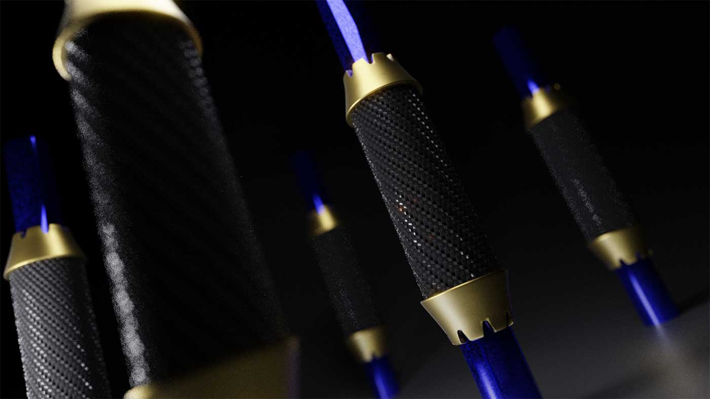
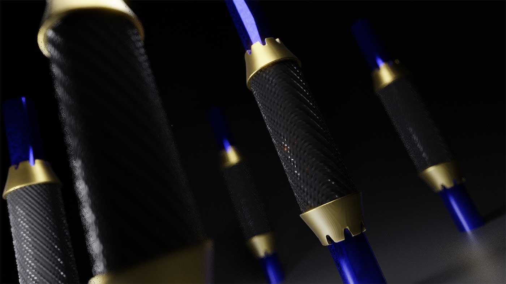
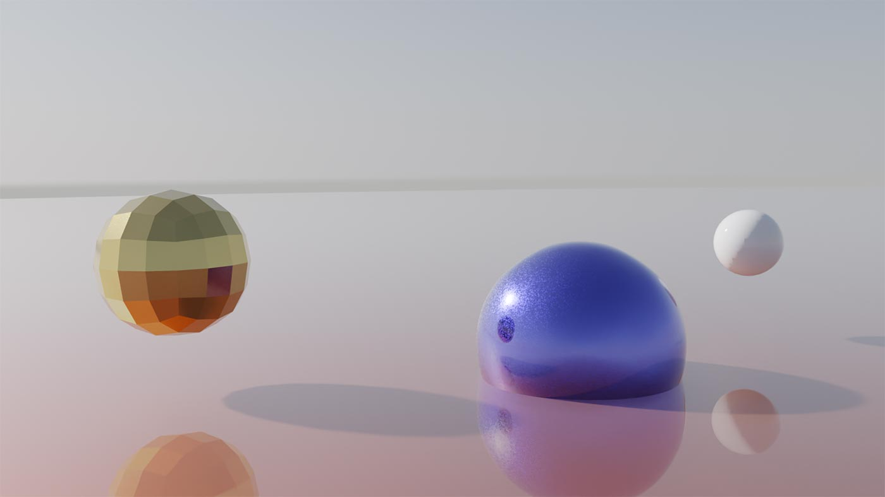

[Blender](https://www.blender.org/)の新バージョン、2.83 LTSがリリースされました。

多くのユーザーが新機能や改善点を発信されているなか、僕は[AMD Padeon ProRender](https://www.amd.com/ja/technologies/radeon-prorender-blender)の話をします。はい、2.83とかまったく関係ありません（笑）

僕はVega20を積んだMacbook Proを使っているので、ProRenderのことを調べることが多いです。[僕のWordPressサイト](https://nnamm.com)でもProRenderの記事がよく読まれています。

 

今回は**「ProRenderのRPR DenoiserとBlenderのDenoise Nodeはどちらが綺麗にノイズを除去してくれるのかな？」**を以下2つの観点で検証しました。

1. RPR Denoiser（全フィルタ）とDenoise Node ON/OFFで生成される画像とレンダリング時間の違い
2. RPR Denoiser（Bilateral）ON/OFFの違い

 

結論を先にいうと**『Denoise Nodeのみ使う方がいい感じの絵が得られる』**でした。

## 環境

* Macbook Pro 2018年モデル（Vega20）
* macOS Catalina
* Blender 2.83 LTS

## ProRender RPR Denoiser

2020年5月にProRender v2.4系がリリースされました。現段階で4種類のデノイズフィルタがあります。

1. Bilateral
2. Local Weighted Regression
3. Edge Avoiding Wavelets
4. Machine Learning

v2.4でmacOSのML Denoisingがサポートされたこともあり、いっちょ性能を調べてみようと思ったのです。この記事を書くきっかけですね。

## Blender Denoise Node

Blender 2.81のときIntel Open Image Denoiseを搭載したNodeが追加されました。

▶︎ [Blender｜Intel製AIノイズ除去機能「Intel Open Image Denoiser」を試す – Takashi Q. Hanamura Photography](https://nnamm.com/blog/6564)

ノイズ除去させるにはいくつかの設定が必要です。しかし、レンダラーをProRenderに変更するとそれらの設定ができません。でも、CompositingでRender LayersからDenoise Nodeを通すだけでも効果はあるのでまぁ問題はないでしょう。

では、以降で検証しますね。ちなみにONが有効でOFFが無効って意味です。

## 【検証1】RPR Denoiser（全フィルタ）とDenoise Node ON/OFFで生成される画像とレンダリング時間の違い

* データ：『[01. Practice (Still)](https://nnamm.work/posts/g0001-200322-blender-prac-still/)』の真ん中あたりの作品
* Resolution：1920 x 1080pxで出力
* Sampling：Min/128、Max/256（そのほかデフォルト設定）
* RPR Denoiser：すべてデフォルト設定
* カッコ内はレンダリング時間（分 秒 ミリ秒）

### ①RPR Denoiser(OFF) & Donoise Node(OFF) [1m18s33]

左手前部分のボケがノイジーです。

### ②RPR Denoiser(OFF) & Donoise Node(ON) [1m20s20]

①に比べ、左手前部分のボケのノイジーさが緩和されました。最終的に僕のベストはこの設定です。

### ③RPR Denoiser(Bilateral) & Donoise Node(OFF) [1m19s29]

### ④RPR Denoiser(Bilateral) & Donoise Node(ON) [1m21s23]

③と④はどちらもあまり変わらない感じ。③の場合、中心付近に赤い斑点が目立ちますが、Denoise Node ONにすると消えます。

### ⑤RPR Denoiser(Local Weighted Regression) & Donoise Node(OFF) [1m21s71]

### ⑥RPR Denoiser(Local Weighted Regression) & Donoise Node(ON) [1m23s99]

③と④と同じ感想です。

### ⑦RPR Denoiser(Edge Avoiding Wavelets) & Donoise Node(OFF) [1m19s51]

### ⑧RPR Denoiser(Edge Avoiding Wavelets) & Donoise Node(ON) [1m21s15]

Edge Avoiding Waveletsフィルタは独特です。ONにすると表面が流れているようになって、正直「え？これありなの？」と思ったくらいです。これが活かせるシーンはあるのでしょうけど、僕はわからなかったです。

### ⑨RPR Denoiser(Machine Learning) & Donoise Node(OFF) [1m22s65]

### ⑩RPR Denoiser(Machine Learning) & Donoise Node(ON) [1m25s94]

⑨も⑩もノイズ除去はいい感じだと思います。ただ、赤い斑点が消えませんでした。となると設定したテクスチャなどが影響していたりするのかもです。

> ※Machine Learningについて 
Use Color AOV onlyというチェックボックスがあるのですが、ONにするとなぜか真っ暗画像がレンダリングされてしまうためOFFにしました。

### レンダリング時間比較表（速い順）

| バターン | レンダリング時間 |  |
| ---- | ---- | ---- |
| ①RPR Denoiser(OFF) & Denoise Node(OFF) | 1m18s33 | |
| ③RPR Denoiser(Bilateral) & Denoise Node(OFF) | 1m19s29 | |
| ⑦RPR Denoiser(Edge Avoiding Wavelets) & Denoise Node(OFF) | 1m19s51 | |
| ②RPR Denoiser(OFF) & Denoise Node(ON) | 1m20s20 | ★ |
| ⑧RPR Denoiser(Edge Avoiding Wavelets) & Denoise Node(ON) | 1m21s15 | |
| ④RPR Denoiser(Bilateral) & Denoise Node(ON) | 1m21s23 | |
| ⑤RPR Denoiser(Local Weighted Regression) & Denoise Node(OFF) | 1m21s71 | |
| ⑨RPR Denoiser(Machine Learning) & Denoise Node(OFF) | 1m22s65 | |
| ⑥RPR Denoiser(Local Weighted Regression) & Denoise Node(ON) | 1m23s99 | |
| ⑩RPR Denoiser(Machine Learning) & Denoise Node(ON) | 1m25s94 | |

レンダリングは1回しかしていませんし、検証はこのシーンデータでしかしていません。サンプルは少ないですが、基本指針としては★で良いんじゃないかな、という結論です。

## 【検証2】RPR Denoiser（Bilateral）ON/OFFの違い

ここではRPR Denoiserの各フィルタのうち、僕の好みのBilateralを見てみます。もっと単純なシーンを使って、ON/OFFでどんな効果があるのか。なお、Denoie Nodeは常にONです。

 

結論をいうと、**Bilateral ONにすると画像が眠くなりました。シャープさが損なわれた感じです。**

* データ：すごく適当でシンプルなシーンデータ
* Sampling：Min/64、Max/128（そのほかデフォルト設定）
* RPR Denoiser：Bilateral（デフォルト設定）
* Denoise Node：ON

▼RPR Denoiser - Bilateral ON

▼RPR Denoiser - Bilateral OFF

PCで見るとわかるのですが、中心の青い球体のエッジがBilateral ONにすると眠くなっているように僕は感じます。

## まとめ

ProRenderを使うときはRPR Denoiserではなく、Blender標準のDenoise Nodeを使いましょう。得られる結果の期待値は高いと思われます。

Denoise NodeもRPR Denoiserも少ないサンプル数でレンダリング時間を短縮し、なおかつ綺麗な画像を生成するためのものです。Machine Learningが取り入れられたりして、これからもどんどん改善されていくはずです。

技術は進歩していき、きっと楽にデノイズできる日は来るでしょうけど、常に試行錯誤は必要だろうな〜と思いました。

## 公式ドキュメント

[Welcome to AMD Radeon™ ProRender! — AMD Radeon ProRender](https://radeon-pro.github.io/RadeonProRenderDocs/index.html)